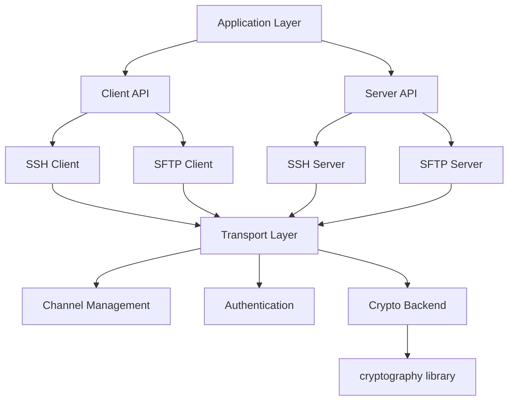

# Design Document

## Overview

The Python SSHv2 library is designed as a modular, secure, and high-performance SSH implementation that provides both client and server capabilities. The architecture follows a layered approach with clear separation of concerns between transport, authentication, channel management, and application-level protocols like SFTP.

## Architecture

### High-Level Architecture



### Module Structure

```
ssh_library/
├── __init__.py
├── client/
│   ├── __init__.py
│   ├── ssh_client.py
│   └── sftp_client.py
├── server/
│   ├── __init__.py
│   ├── ssh_server.py
│   └── sftp_server.py
├── transport/
│   ├── __init__.py
│   ├── transport.py
│   ├── channel.py
│   └── kex.py
├── auth/
│   ├── __init__.py
│   ├── password.py
│   ├── publickey.py
│   ├── keyboard_interactive.py
│   └── gssapi.py
├── crypto/
│   ├── __init__.py
│   ├── backend.py
│   └── ciphers.py
├── hostkeys/
│   ├── __init__.py
│   ├── policy.py
│   └── storage.py
├── protocol/
│   ├── __init__.py
│   ├── messages.py
│   └── constants.py
└── exceptions.py
```

## Components and Interfaces

### Transport Layer

**Transport Class**
- Manages SSH protocol handshake and key exchange
- Handles message parsing and encryption/decryption
- Maintains connection state and security parameters

```python
class Transport:
    def __init__(self, socket: socket.socket)
    def start_client(self, timeout: Optional[float] = None) -> None
    def start_server(self, server_key: PKey, timeout: Optional[float] = None) -> None
    def auth_password(self, username: str, password: str) -> bool
    def auth_publickey(self, username: str, key: PKey) -> bool
    def open_channel(self, kind: str, dest_addr: Optional[Tuple] = None) -> Channel
    def close(self) -> None
```

**Channel Class**
- Represents individual communication channels within SSH connection
- Handles data transmission and flow control
- Supports different channel types (session, direct-tcpip, etc.)

```python
class Channel:
    def send(self, data: bytes) -> int
    def recv(self, nbytes: int) -> bytes
    def exec_command(self, command: str) -> None
    def invoke_shell(self) -> None
    def get_exit_status(self) -> int
    def close(self) -> None
```

### Client Components

**SSHClient Class**
- High-level interface for SSH client operations
- Manages connection lifecycle and authentication
- Provides convenient methods for common operations

```python
class SSHClient:
    def __init__(self)
    def set_missing_host_key_policy(self, policy: MissingHostKeyPolicy) -> None
    def connect(self, hostname: str, port: int = 22, username: Optional[str] = None,
                password: Optional[str] = None, pkey: Optional[PKey] = None,
                timeout: Optional[float] = None) -> None
    def exec_command(self, command: str, bufsize: int = -1) -> Tuple[ChannelFile, ChannelFile, ChannelFile]
    def invoke_shell(self) -> Channel
    def open_sftp(self) -> SFTPClient
    def close(self) -> None
```

**SFTPClient Class**
- Implements SFTP protocol for file operations
- Provides file system operations over SSH
- Handles SFTP-specific error conditions

```python
class SFTPClient:
    def get(self, remotepath: str, localpath: str) -> None
    def put(self, localpath: str, remotepath: str) -> None
    def listdir(self, path: str = '.') -> List[str]
    def stat(self, path: str) -> SFTPAttributes
    def chmod(self, path: str, mode: int) -> None
    def mkdir(self, path: str, mode: int = 0o777) -> None
    def rmdir(self, path: str) -> None
    def close(self) -> None
```

### Server Components

**SSHServer Class**
- Base class for SSH server implementations
- Handles client authentication and authorization
- Manages server-side channel operations

```python
class SSHServer:
    def check_auth_password(self, username: str, password: str) -> int
    def check_auth_publickey(self, username: str, key: PKey) -> int
    def check_channel_request(self, kind: str, chanid: int) -> int
    def check_channel_exec_request(self, channel: Channel, command: bytes) -> bool
    def check_channel_shell_request(self, channel: Channel) -> bool
```

**SFTPServer Class**
- Implements server-side SFTP functionality
- Handles file system operations and permissions
- Provides hooks for custom file system backends

```python
class SFTPServer:
    def list_folder(self, path: str) -> List[SFTPAttributes]
    def stat(self, path: str) -> SFTPAttributes
    def open(self, path: str, flags: int, attr: SFTPAttributes) -> SFTPHandle
    def mkdir(self, path: str, attr: SFTPAttributes) -> int
    def rmdir(self, path: str) -> int
```

## Data Models

### Key Exchange and Cryptography

**Key Exchange Process**
1. Protocol version exchange
2. Algorithm negotiation (KEX, host key, encryption, MAC, compression)
3. Diffie-Hellman key exchange
4. Host key verification
5. Service request (ssh-userauth, ssh-connection)

**Supported Algorithms**
- Key Exchange: curve25519-sha256, ecdh-sha2-nistp256, diffie-hellman-group14-sha256
- Host Keys: ssh-ed25519, ecdsa-sha2-nistp256, rsa-sha2-256
- Encryption: chacha20-poly1305, aes256-gcm, aes128-gcm, aes256-ctr
- MAC: hmac-sha2-256, hmac-sha2-512 (when not using AEAD ciphers)

### Authentication Models

**Authentication Flow**
```python
@dataclass
class AuthResult:
    success: bool
    partial_success: bool
    allowed_methods: List[str]
    
@dataclass
class UserAuthRequest:
    username: str
    service: str
    method: str
    method_data: bytes
```

### Host Key Management

**Host Key Policies**
```python
class MissingHostKeyPolicy:
    def missing_host_key(self, client: SSHClient, hostname: str, key: PKey) -> None
        
class AutoAddPolicy(MissingHostKeyPolicy):
    # Automatically adds unknown host keys
    
class RejectPolicy(MissingHostKeyPolicy):
    # Rejects all unknown host keys
    
class WarningPolicy(MissingHostKeyPolicy):
    # Logs warning but accepts unknown host keys
```

## Error Handling

### Exception Hierarchy

```python
class SSHException(Exception):
    """Base exception for all SSH-related errors"""
    
class AuthenticationException(SSHException):
    """Authentication failed"""
    
class BadHostKeyException(SSHException):
    """Host key verification failed"""
    
class ChannelException(SSHException):
    """Channel operation failed"""
    
class SFTPError(SSHException):
    """SFTP operation failed"""
    
class TransportException(SSHException):
    """Transport layer error"""
    
class ProtocolException(SSHException):
    """SSH protocol violation"""
```

### Error Recovery Strategies

1. **Connection Errors**: Automatic retry with exponential backoff
2. **Authentication Failures**: Clear error messages with suggested remediation
3. **Channel Errors**: Graceful channel cleanup and resource release
4. **SFTP Errors**: Detailed error codes matching SFTP specification
5. **Crypto Errors**: Secure error handling without information leakage

## Testing Strategy

### Unit Testing
- **Transport Layer**: Mock socket connections, test protocol state machines
- **Authentication**: Test all auth methods with various credential types
- **Crypto Backend**: Test cipher operations and key generation
- **Channel Management**: Test channel lifecycle and data flow
- **SFTP Operations**: Test file operations with temporary file systems

### Integration Testing
- **Client-Server**: Full SSH handshake and operation testing
- **Cross-Platform**: Test on Linux, macOS, and Windows
- **Interoperability**: Test against OpenSSH and other SSH implementations
- **Performance**: Benchmark against Paramiko and other libraries

### Security Testing
- **Fuzzing**: Protocol message fuzzing with custom and existing tools
- **Cryptographic**: Test key generation, exchange, and cipher operations
- **Authentication**: Test auth bypass attempts and timing attacks
- **Host Key**: Test host key verification and MITM scenarios

### Compliance Testing
- **RFC Compliance**: Automated tests for RFC 4251-4254 requirements
- **Algorithm Support**: Verify all required and optional algorithms
- **Protocol Versions**: Test SSHv2 compliance and version negotiation
- **Edge Cases**: Test protocol edge cases and error conditions

## Performance Considerations

### Optimization Strategies
1. **Async Support**: Optional asyncio support for high-concurrency applications
2. **Buffer Management**: Efficient buffer allocation and reuse
3. **Crypto Acceleration**: Leverage hardware acceleration when available
4. **Connection Pooling**: Reuse connections for multiple operations
5. **Streaming**: Support for streaming large file transfers

### Memory Management
- Use memory views for zero-copy operations where possible
- Implement proper cleanup for crypto contexts
- Avoid unnecessary data copying in protocol handling
- Use weak references for callback management

## Security Design

### Secure Defaults
- Default to strongest available algorithms
- Require host key verification by default
- Use secure random number generation
- Implement constant-time comparisons for sensitive data

### Threat Mitigation
- **MITM Attacks**: Strict host key verification
- **Timing Attacks**: Constant-time authentication checks
- **Information Leakage**: Sanitized logging and error messages
- **Replay Attacks**: Proper sequence number handling
- **Downgrade Attacks**: Algorithm preference enforcement

### Compliance
- Follow NIST guidelines for cryptographic algorithms
- Implement FIPS 140-2 compatible modes when requested
- Support for enterprise security policies
- Regular security audits and vulnerability assessments