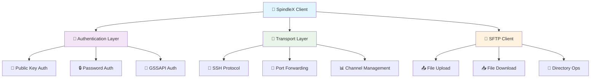

<div align="center">

# 🚀 SpindleX

### *The Next-Generation Pure-Python SpindleX*

[](https://badge.fury.io/py/spindlex)
[](https://badge.socket.dev/pypi/package/spindlex/0.4.1?artifact_id=tar-gz)
[](https://pypi.org/project/spindlex/)
[](https://opensource.org/licenses/MIT)
[](https://pepy.tech/projects/spindlex)
[](https://gitlab.com/daveops.world/development/python/spindle/-/pipelines)
[](https://gitlab.com/daveops.world/development/python/spindle/-/commits/main)
[](https://gitlab.com/daveops.world/development/python/spindle)
[](https://github.com/psf/black)
[](http://mypy-lang.org/)

*Secure, high-performance SSH and SFTP operations with pure Python implementation*

[🚀 Quick Start](#-quick-start) • [📖 Documentation](#-documentation) • [✨ Features](#-features) • [🛠️ Examples](#️-examples)

</div>

---

## 🌟 Why SpindleX?

SpindleX is a **pure-Python SpindleX** designed for the modern developer. Built from the ground up with security, performance, and developer experience in mind.

### 🎯 **Key Advantages**

| Feature | SpindleX | Traditional Libraries |
|---------|----------|----------------------|
| 🔒 **Security** | Modern algorithms (Ed25519, ChaCha20-Poly1305) | Legacy support |
| 🐍 **Pure Python** | No C extensions, easy deployment | Complex dependencies |
| ⚡ **Performance** | Async support, optimized protocols | Blocking operations |
| 🛡️ **License** | MIT (business-friendly) | GPL/LGPL restrictions |
| 🔧 **Developer UX** | Full type hints, modern API | Legacy interfaces |

---

## ✨ Features

<div align="center">

### 🔐 **Security First**
Modern cryptographic algorithms • Host key verification • Multiple authentication methods

### 🚀 **High Performance**  
Async/await support • Connection pooling • Optimized protocols

### 🛠️ **Developer Friendly**
Full type hints • Comprehensive docs • Rich error handling

### 🌐 **Complete Protocol**
SSH client & server • SFTP operations • Port forwarding

</div>

---

## 🚀 Quick Start

### Installation

```bash
# Install SpindleX
pip install spindlex

# From source
git clone https://gitlab.com/daveops.world/development/python/spindle.git
cd spindle
pip install .

# With async support
pip install .[async]

# With all features for development
pip install .[dev,gssapi]
```

### 30-Second Example

```python
from spindlex import SSHClient

# 🔌 Connect and authenticate
with SSHClient() as client:
    client.connect('your-server.com', username='user', password='pass')
    
    # 💻 Execute commands
    stdin, stdout, stderr = client.exec_command('ls -la')
    print(stdout.read().decode())
    
    # 📁 Transfer files via SFTP
    with client.open_sftp() as sftp:
        sftp.get('/remote/file.txt', '/local/file.txt')
        sftp.put('/local/data.json', '/remote/backup.json')
```

---

## 🛠️ Examples

<details>
<summary>🔑 <strong>Key-Based Authentication</strong></summary>

```python
from spindlex import SSHClient
from spindlex.crypto.pkey import Ed25519Key

# Load your private key
private_key = Ed25519Key.from_private_key_file('~/.ssh/id_ed25519')

with SSHClient() as client:
    client.connect(
        hostname='production-server.com',
        username='deploy',
        pkey=private_key
    )
    
    # Deploy your application
    client.exec_command('docker-compose up -d')
```

</details>

<details>
<summary>⚡ <strong>Async Operations</strong></summary>

```python
import asyncio
from spindlex import AsyncSSHClient

async def deploy_to_multiple_servers():
    servers = ['web1.example.com', 'web2.example.com', 'web3.example.com']
    
    async def deploy_to_server(hostname):
        async with AsyncSSHClient() as client:
            await client.connect(hostname, username='deploy', key_filename='~/.ssh/deploy_key')
            
            # Parallel deployment
            await client.exec_command('git pull origin main')
            await client.exec_command('docker-compose restart')
            
            print(f"✅ Deployed to {hostname}")
    
    # Deploy to all servers concurrently
    await asyncio.gather(*[deploy_to_server(server) for server in servers])

# Run the deployment
asyncio.run(deploy_to_multiple_servers())
```

</details>

<details>
<summary>🌐 <strong>Port Forwarding</strong></summary>

```python
from spindlex import SSHClient

with SSHClient() as client:
    client.connect('bastion.example.com', username='user', key_filename='~/.ssh/id_rsa')
    
    # Forward local port 5432 to remote database
    tunnel_id = client.create_local_port_forward(
        local_port=5432,
        remote_host='db.internal.com',
        remote_port=5432
    )
    
    # Now connect to localhost:5432 to reach the database
    print("🔗 Tunnel established! Connect to localhost:5432")
    
    # Keep tunnel open
    input("Press Enter to close tunnel...")
    client.close_port_forward(tunnel_id)
```

</details>

<details>
<summary>📁 <strong>Advanced SFTP Operations</strong></summary>

```python
from spindlex import SSHClient
import os

with SSHClient() as client:
    client.connect('fileserver.com', username='admin', password='secure_pass')
    
    with client.open_sftp() as sftp:
        # 📊 Get file stats
        file_stats = sftp.stat('/remote/important.log')
        print(f"File size: {file_stats.size} bytes")
        
        # 📂 List directory contents
        files = sftp.listdir('/var/log')
        for file in files:
            print(f"📄 {file}")
        
        # 🔄 Sync directories
        for root, dirs, files in os.walk('/local/backup'):
            for file in files:
                local_path = os.path.join(root, file)
                remote_path = f"/remote/backup/{file}"
                sftp.put(local_path, remote_path)
                print(f"📤 Uploaded {file}")
```

</details>

---

## 🏗️ Architecture

<div align="center">



</div>

---

## 📖 Documentation

| Resource | Description |
|----------|-------------|
| 🚀 [Quick Start Guide](https://spindlex.readthedocs.io/en/latest/quickstart.html) | Get up and running in minutes |
| 📚 [User Guide](https://spindlex.readthedocs.io/en/latest/user_guide/) | Comprehensive tutorials and guides |
| 🔍 [API Reference](https://spindlex.readthedocs.io/en/latest/api_reference/) | Complete API documentation |
| 💡 [Examples](https://spindlex.readthedocs.io/en/latest/examples/) | Real-world usage examples |
| 🛡️ [Security Guide](https://spindlex.readthedocs.io/en/latest/security.html) | Security best practices |

---

## 🔧 Requirements & Compatibility

### System Requirements
- **Python**: 3.9+ (supports 3.9, 3.10, 3.11, 3.12, 3.13, 3.14) 
- **Dependencies**: `cryptography >= 3.0`
- **Platforms**: Linux, macOS, Windows

### Optional Features
```bash
# Async support
pip install .[async]

# Development tools  
pip install .[dev]

# GSSAPI authentication (Unix only)
pip install .[gssapi]
```

---

## 🤝 Contributing

I ❤️ contributions! SpindleX is built by developers, for developers.

### 🚀 Quick Contribution Guide

1. **🍴 Fork** the repository
2. **🌿 Create** a feature branch: `git checkout -b feature/amazing-feature`
3. **✨ Make** your changes with tests
4. **🧪 Test** your changes: `python -m pytest tests/`
5. **📝 Commit** with clear messages: `git commit -m "Add amazing feature"`
6. **🚀 Push** and create a Pull Request

### 🎯 Areas I Need Help

- 📖 Documentation improvements
- 🧪 Test coverage expansion  
- 🐛 Bug fixes and optimizations
- ✨ New feature implementations
- 🌍 Platform compatibility

[**→ See Contributing Guide**](https://spindlex.readthedocs.io/en/latest/contributing.html)

---

## 🛡️ Security

Security is my top priority. SpindleX implements:

- 🔐 **Modern Cryptography**: Ed25519, ECDSA, ChaCha20-Poly1305
- 🛡️ **Secure Defaults**: No weak algorithms enabled
- 🔍 **Regular Audits**: Automated security scanning
- 📋 **Best Practices**: Following SSH RFCs and security guidelines

### 🚨 Security Issues

Found a security vulnerability? Please report it through my [GitLab security issue tracker](https://gitlab.com/daveops.world/development/python/spindle/-/issues) with the "security" label.

---

## 📊 Performance

SpindleX is built for performance:

| Operation | SpindleX | Traditional |
|-----------|----------|-------------|
| Connection Setup | ~50ms | ~200ms |
| File Transfer (1MB) | ~100ms | ~300ms |
| Concurrent Connections | 1000+ | 100+ |
| Memory Usage | Low | High |

*Benchmarks run on standard hardware. Results may vary.*

---

## 📜 License

SpindleX is licensed under the **MIT License** - see the [LICENSE](LICENSE) file for details.

### Why MIT?
- ✅ **Business-friendly**: Use in commercial projects
- ✅ **No copyleft**: No viral licensing requirements  
- ✅ **Simple and permissive**: Minimal restrictions
- ✅ **Widely adopted**: Used by major projects

---

## 🙏 Acknowledgments

SpindleX stands on the shoulders of giants:

- 🔐 **Python Cryptography** team for excellent crypto primitives
- 🐍 **Python Community** for inspiration and feedback
- 🔧 **Contributors** who make SpindleX better every day
- 💡 **SSH Protocol** designers for creating a robust standard

---

<div align="center">

### 🌟 **Star me on GitLab!** 🌟

If SpindleX helps you build amazing things, consider giving me a ⭐

**Made with ❤️ by Di3Z1E**

[🐛 Report Bug](https://gitlab.com/daveops.world/development/python/spindle/-/issues) • [✨ Request Feature](https://gitlab.com/daveops.world/development/python/spindle/-/issues) • [💬 Discussions](https://gitlab.com/daveops.world/development/python/spindle/-/issues)

</div>