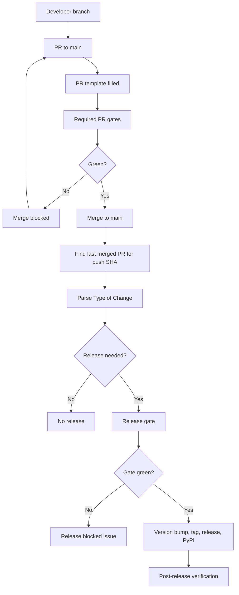

# SpindleX Lifecycle Overview And Stage Gates

This internal documentation set is the developer-facing breakdown of `PLAN.md`.
Use these files as the implementation source of truth for lifecycle work.

The lifecycle is split into two operating stages:

- Before `1.0.0`: beta stabilization and production-readiness preparation.
- After `1.0.0`: production-grade operation, compatibility discipline, and adoption.

## Target Flow

```text
feature branch
-> pull request to main
-> required PR gates
-> merge to protected main
-> release decision from merged PR
-> release gate
-> version/tag/GitHub Release/PyPI
-> verification
-> feedback loop
```

## Main Lifecycle



## Stage 1: Before `1.0.0`

Goal: make the project safe, repeatable, understandable, and credible before
claiming stable production readiness.

Required capabilities before `1.0.0`:

- Protected `main` with PR-required development.
- Required PR gates and PR template validation.
- Release automation from the last merged PR associated with the push SHA.
- PyPI trusted publishing.
- Idempotent release pipeline.
- Release failure tracking.
- Compatibility matrix and documented compatibility policy.
- Real-host canary validation policy.
- Reproducible benchmark entry point and methodology.
- Security and trust documentation.
- Developer quickstarts and accurate examples.
- Migration and upgrade documentation.
- Documentation drift checks.

Exit criteria for beta:

- New PRs are template-driven and cannot merge without one valid type.
- Release-impact PRs produce the correct semantic version bump.
- No-release PRs never publish artifacts.
- Release automation is safe to rerun.
- PyPI artifacts are verified after publish.
- Compatibility, security, performance, and migration docs exist.
- Canary validation exists or has an explicit fallback decision.

## Stage 2: After `1.0.0`

Goal: operate SpindleX as a production-grade open-source library.

Post-`1.0.0` operating expectations:

- Strict semantic versioning.
- Breaking changes only in major releases.
- Deprecations include warnings and migration guidance.
- Compatibility matrix stays current.
- Release notes include compatibility, security, and performance impact when relevant.
- User feedback becomes docs, tests, compatibility entries, or benchmarks.
- Distribution expands only after the core lifecycle remains reliable.

## Release Decision Contract

Release decisions are based only on the last merged PR associated with the push
SHA.

If multiple PRs are merged before the workflow runs, only the latest merged PR
determines the release type and version bump.

Release mapping:

| PR type | Release |
| --- | --- |
| `breaking` | Major |
| `feature` | Minor |
| `bug` | Patch |
| `docs` | No release |
| `refactor` | No release |
| `test` | No release |

## Version Source Of Truth

- `pyproject.toml` is the single source of truth for the project version.
- `spindlex/_version.py` must be derived from `pyproject.toml` during release.
- Release validation must fail if package metadata, tag, and runtime version do
  not match.

## Documentation Set

- `01-overview-and-stage-gates.md`: lifecycle split and stage gates.
- `02-before-v1-lifecycle-epics.md`: pre-`1.0.0` lifecycle implementation epics.
- `03-before-v1-release-process-epics.md`: pre-`1.0.0` release automation epics.
- `04-before-v1-quality-security-epics.md`: CI, security, and failure tracking epics.
- `05-before-v1-product-readiness-epics.md`: docs, DX, benchmarks, canaries, adoption.
- `06-v1-release-candidate.md`: `1.0.0` release-candidate checklist.
- `07-after-v1-operations-epics.md`: post-`1.0.0` operating model.
- `08-failure-handling-and-observability.md`: failures, issues, flaky pipelines.
- `09-implementation-roadmap.md`: suggested implementation order.
