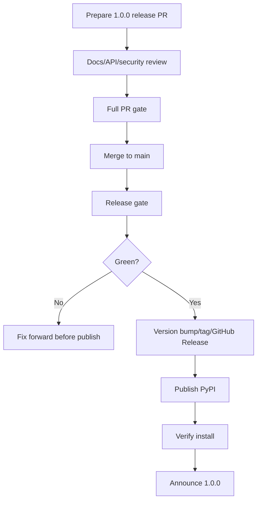

# `1.0.0` Release Candidate Plan

This checklist defines what must be true before cutting `1.0.0`.

## Goal

Ship the first stable SpindleX release with clear compatibility, security,
upgrade, and support expectations.

## Release Candidate Entry Criteria

The project may enter `1.0.0` release-candidate work when:

- Required PR gates are stable.
- Release automation has succeeded multiple times for beta releases.
- PyPI trusted publishing works.
- Release reruns are idempotent.
- Docker integration tests are stable.
- Compatibility docs exist.
- Canary validation exists or fallback policy is documented.
- Benchmark methodology exists.
- Security threat model exists.
- Migration guide exists.

## Release Candidate Work Items

### Public API Review

- Review sync client API.
- Review async client API.
- Review SFTP API.
- Review host key policy behavior.
- Review exceptions and error model.
- Review CLI names and arguments.
- Mark unstable APIs explicitly or remove from stable docs.

Acceptance criteria:

- No accidental public API is presented as stable.
- All stable public examples are intentional.

### Compatibility Freeze

- Finalize supported Python versions.
- Finalize supported OS claims.
- Finalize tested OpenSSH and Dropbear claims.
- Remove unsupported classifiers.
- Update `docs/compatibility.md`.

Acceptance criteria:

- README, docs, PyPI classifiers, and CI agree.

### Migration Guide

- Create `docs/migration/0.x-to-1.0.md`.
- Document:
  - renamed APIs
  - changed defaults
  - changed exceptions
  - host key behavior
  - sync/async differences
  - deprecated APIs removed or retained
- Add migration notes to release notes.

Acceptance criteria:

- A beta user can upgrade without diffing source code.

### Security And Trust Review

- Review `docs/security.md`.
- Review `meta/SECURITY.md`.
- Confirm vulnerability reporting path.
- Confirm threat model.
- Confirm host key warning language.
- Confirm no examples recommend unsafe production behavior.

Acceptance criteria:

- Security docs are honest, specific, and not overclaimed.

### Final Validation

Run:

- Required PR gate.
- Ubuntu Python `3.9-3.13` unit matrix.
- Windows Python 3.11 smoke.
- macOS Python 3.11 smoke.
- Integration tests.
- Canary validation or documented fallback approval.
- Build and import validation.
- Benchmark baseline.

Required commands:

```bash
python -m build
twine check dist/*
spindlex-benchmark --scenario basic --output results.json
```

Acceptance criteria:

- All release-blocking checks pass.
- Optional failures are documented and accepted explicitly.

## `1.0.0` Release Flow



## Exit Criteria

`1.0.0` is complete when:

- PyPI package installs successfully.
- Runtime version equals `1.0.0`.
- GitHub Release exists.
- Changelog and migration guide are published.
- Compatibility matrix is published.
- Known limitations are published.
- Security docs are linked from README.
- Benchmark baseline is published or attached.
