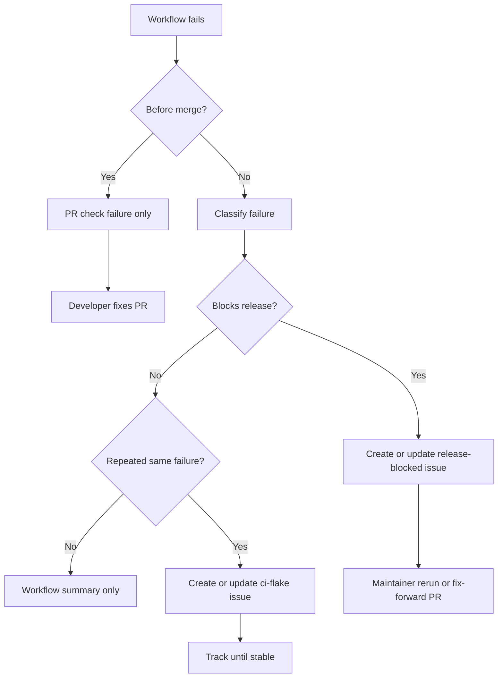
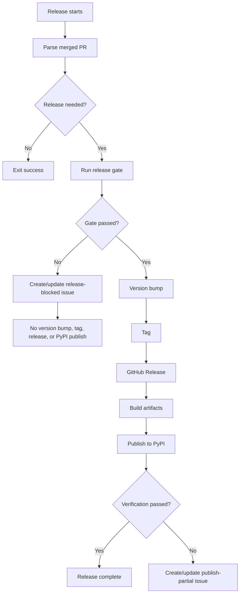

# Failure Handling And Observability

This document defines how to handle failed workflows, flaky pipelines, release
blocks, and partial publishes.

## Failure Classes

| Class | Meaning | Issue? |
| --- | --- | --- |
| `pr-failure` | PR gate failed before merge | No |
| `infra-flake` | Network/cache/runner issue, passes on rerun | No unless repeated |
| `ci-flake` | Same job/failure repeats | Yes |
| `release-blocked` | Release gate failed after merge | Yes |
| `security-blocker` | Security scan blocks release | Yes |
| `publish-partial` | Tag/release/PyPI state is partial or inconsistent | Yes |
| `code-regression` | `main` is broken by code | Yes |

## Failure Flow



## Issue Templates

Add:

```text
.github/ISSUE_TEMPLATE/ci_failure.yml
.github/ISSUE_TEMPLATE/release_blocked.yml
.github/ISSUE_TEMPLATE/flaky_pipeline.yml
```

### `ci_failure.yml`

Labels:

```text
ci, triage
```

Fields:

- Workflow name.
- Job name.
- Run URL.
- Commit SHA.
- Branch.
- Failure class.
- Failure summary.
- First seen.
- Latest seen.
- Rerun result.
- Suspected owner.

### `release_blocked.yml`

Labels:

```text
release-blocked, ci, triage
```

Fields:

- Source PR.
- Source SHA.
- Release type.
- Planned version.
- Failed stage.
- Run URL.
- Artifact state.
- PyPI state.
- Required action.

### `flaky_pipeline.yml`

Labels:

```text
flake, ci, triage
```

Fields:

- Workflow.
- Job.
- Runner.
- Python version.
- Failure signature.
- Frequency.
- First seen.
- Last seen.
- Last successful run.
- Suspected cause.
- Close condition.

## Automated Issue Behavior

Do not open an issue for every failed job.

Create/update issues for:

- Release gate failure after merge.
- Partial release state.
- Repeated flaky CI.
- Security blocker.
- Post-merge compatibility regression.

Do not create issues for:

- Normal PR failures before merge.
- First-time network/cache hiccups.
- Canceled workflows.
- Failures fixed by a simple rerun.

Deduplication key:

```text
workflow/job/failure-class/failure-signature-hash
```

Automation steps:

1. Compute failure key.
2. Search open issues with matching labels and failure key.
3. If found, comment with latest run URL, SHA, timestamp, and summary.
4. If not found, create a new issue using the relevant template shape.

Close conditions:

- `release-blocked`: release succeeds.
- `publish-partial`: artifact state verified or fix-forward release completed.
- `ci-flake`: 3 consecutive scheduled/main runs pass.

## Release Failure Handling



Rules:

- If release gate fails:
  - no version bump
  - no tag
  - no GitHub Release
  - no PyPI publish
- If tag creation fails:
  - continue only if existing tag points to expected commit
  - fail hard if existing tag points elsewhere
- If PyPI publish fails:
  - retry only if version is absent from PyPI
  - if bad artifact exists on PyPI, fix forward
- If post-release verification fails:
  - open/update `publish-partial`
  - do not delete tags or PyPI artifacts automatically

## Flaky Pipeline Strategy

- Add `timeout-minutes` to Docker/integration jobs.
- Use `pytest-timeout` for real-server tests.
- Use workflow `concurrency` to cancel stale PR runs.
- Retry only infrastructure-sensitive steps:
  - Docker image pull.
  - Dependency install.
  - Scanner database download.
  - PyPI verification polling.
- Do not auto-retry assertion failures by default.
- If `main` is broken by code, fix forward with a new PR.
- If `main` is blocked by infra only, rerun after triage.

## Workflow Summaries

Every post-merge or release workflow should summarize:

- source PR
- source SHA
- release needed
- release type
- failed job or stage
- failure class
- issue URL if created/updated
- rerun or fix-forward recommendation
